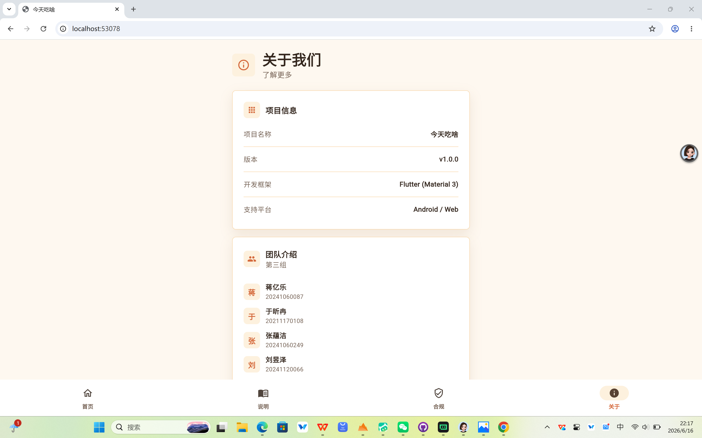
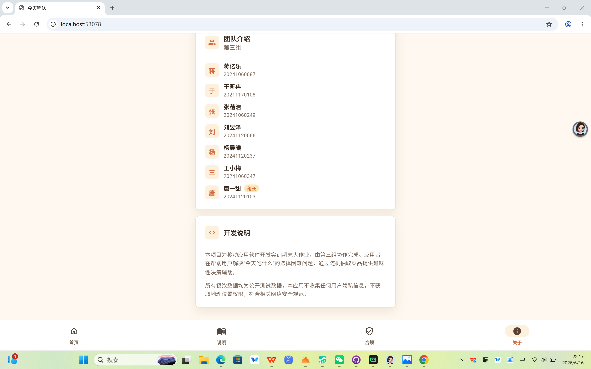

# Member D 交付文档 — "关于我们"页面

## 页面概述

"关于我们"页面位于底部导航栏最右侧，点击「关于」标签进入。页面采用卡片式布局，共包含三张卡片，分别介绍项目信息、团队成员和开发说明。

---

## 一、项目信息卡片

| 字段 | 内容 |
|------|------|
| 项目名称 | 今天吃啥 |
| 版本 | v1.0.0 |
| 开发框架 | Flutter (Material 3) |
| 支持平台 | Android / Web |

---

## 二、团队介绍卡片

**团队名称**：第三组

**成员列表**（共 7 人，按学号排序）：

| 姓名 | 学号 | 备注 |
|------|------|------|
| 蒋亿乐 | 20241060087 | — |
| 于昕冉 | 20211170108 | — |
| 张蕴洁 | 20241060249 | — |
| 刘昱泽 | 20241120066 | — |
| 杨晨曦 | 20241120237 | — |
| 王小梅 | 20241060347 | — |
| 唐一甜 | 20241120103 | 组长 |

> 每位成员的姓名首字母以圆形头像展示，学号显示在姓名下方。

---

## 三、开发说明卡片

**正文内容：**

> 本项目为移动应用软件开发实训期末大作业，由第三组协作完成。应用旨在帮助用户解决"今天吃什么"的选择困难问题，通过随机抽取菜品提供趣味性决策辅助。

> 所有餐饮数据均为公开测试数据，本应用不收集任何用户隐私信息，不获取地理位置权限，符合相关网络安全规范。

---

## 运行截图

### 截图 1

显示页面头部（"关于我们"标题）、项目信息卡片，以及团队介绍卡片的前 5 位成员。

### 截图 2

显示团队介绍剩余 2 位成员（杨晨曦、王小梅、唐一甜），以及开发说明卡片。底部导航栏中「关于」标签处于选中状态。

---

## 文件清单

| 文件 | 说明 |
|------|------|
| `lib/pages/about_page.dart` | "关于我们"页面完整实现 |
| `lib/pages/home_page.dart` | 修改：底部导航栏接入 IndexedStack 四页切换 |
| `docs/member_d/README_D.md` | 本文档 |
| `docs/member_d/screenshots/about_page_1.png` | 运行截图 1 |
| `docs/member_d/screenshots/about_page_2.png` | 运行截图 2 |

## PR 信息

**分支**：`dev/D` → `main`

**Commit 记录：**
1. `feat: 实现"关于我们"页面并完成底部导航栏页面切换`
2. `更新关于我们页面成员信息与开发说明`
3. `docs: 添加D成员交付文档和运行截图（含截图）`
